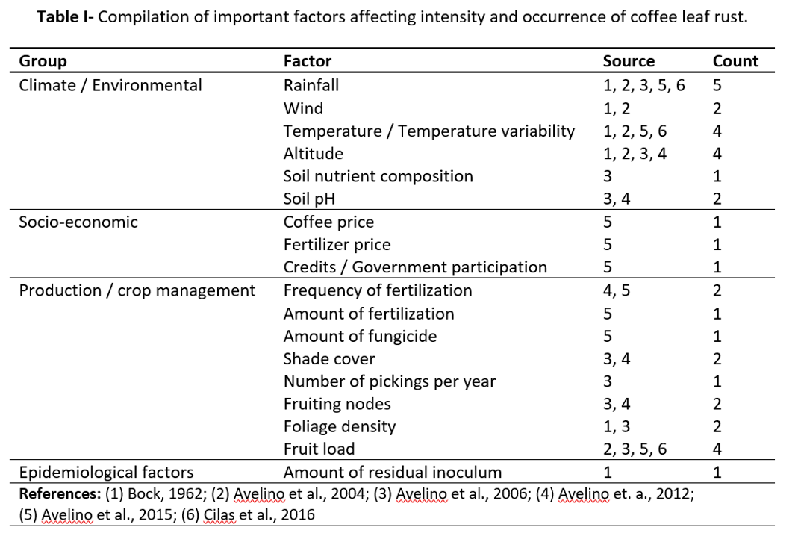

```{r setup, include=FALSE}
knitr::opts_chunk$set(echo = F, message = F, warning = F)
```

```{r load packages}

suppressPackageStartupMessages({
  library(rgdal)
  library(maptools)
  library(sp)
  library(raster)
  library(sp)
  library(tmap)
  library(plotly)
  library(tidyverse)
})

```

```{r load data}

mun_ids <- read.csv("./Data/mun_ids.csv")

load("./Data/royacafe_data.RData")

clr <- royacafe_data %>%
  group_by(Municipality) %>%
  summarize(Nobs = n()) %>%
  mutate(Municipality = as.character(Municipality)) %>%
  rename(NOM_MUN = Municipality) %>%
  left_join(mun_ids, by = "NOM_MUN")


dir = "./Data/Spatial"

stat <- readOGR(dsn = dir, layer = "states", verbose = F)
#stat <- stat[stat$NAME == "Oaxaca",]
proj <- CRS("+proj=lcc +lat_1=17.5 +lat_2=29.5 +lat_0=0 +lon_0=-102 +x_0=2000000 +y_0=0 +datum=NAD27 +units=m +no_defs +ellps=clrk66 +nadgrids=@conus,@alaska,@ntv2_0.gsb,@ntv1_can.dat")

proj2 <- CRS("+proj=longlat +datum=NAD27")

#muni <- readOGR(dsn = dir, layer = "Municipios__2000")

muni <- readShapePoly(fn = file.path(dir, "Municipios__2000"), proj4string = proj)
muni <- muni[muni$NOM_ENT == "Oaxaca", c(10,11)]
muni <- spTransform(muni, CRS("+proj=longlat +datum=NAD27"))


muni@data <- muni@data %>%
  mutate(MUN = as.integer(as.character(MUN))) %>%
  left_join(clr, by = "MUN")


## Temperature data from inifap
load("./Data/inifap_data.RData")

temp <- inifap_data %>%
  group_by(Name, Municipality) %>%
  summarize(latitude = mean(Latitude1, na.rm = T),
            longitude = mean(Longitude1, na.rm = T),
            maxYear = max(Date),
            minYear =min(Date)) %>%
  ungroup()

xy <- data.frame(X = -1*temp$longitude, Y = temp$latitude)
coordinates(xy) <- c("X", "Y")
proj4string(xy) <- proj2  ## for example
res <- spTransform(xy, proj2)
b <- SpatialPointsDataFrame(coords = res, data = temp, proj4string = proj2)

## Temperature data from CliCom
load("./Data/clicom_data.RData")

temp2 <- clicom_data %>%
  mutate(date = as.Date(datenum, origin = "1970-01-01")-719529) %>%
  group_by(id, station) %>%
  summarize(latitude = mean(latitude, na.rm = T),
            longitude = mean(longitude, na.rm = T),
            maxYear = max(date),
            minYear =min(date)) %>%
  ungroup()

xy <- data.frame(X = temp2$longitude, Y = temp2$latitude)
coordinates(xy) <- c("X", "Y")
proj4string(xy) <- proj2  ## for example
res2 <- spTransform(xy, proj2)
c <- SpatialPointsDataFrame(coords = res2, data = temp2, proj4string = proj2)


```

# Assesment of information available for Oaxaca, Mexico

This work had the objective of identify existing climate data and coffee leaf rust incidence data for the state of Oaxaca, Mexico. The initial approach was to gather as much information available, and evaluate if it was enough to identify correlations between leaf rust incidence and climate variability. All the information gathered has been stored in an online Github repository, along with the R and MatLab code used to download, clean, and join all the information. Additionally, ESRI shapefiles for Mexico's states and municipalities are provided. The repository lives permanently at [https://github.com/jcvdav/OaxacaLeafRust](https://github.com/jcvdav/OaxacaLeafRust). Information can be downloaded by downloading a \*.zip folder. The entire folder weights about 0.5 GB.

Databases are provided as Excel spreadsheets (\*.xlsx), MatLab files (\*.mat), R data (\*.RData) and comma-separated values (\*.csv). The Excel files contain a spreadsheet with Metadata, describing each field (column) of the database, as well as the source of the information and relevant comments. Climate data from CLICOM (Deliverable 3) is not available in Excel format due to its large size.

## Recommendations

Based on the observed spatial distribution of data for Oaxaca, it is not possible to pursue further correlation analysis between climate data and coffee leaf rust incidence. The closest climate station-leaf rust data pair is that of the municipality "Candelaria Loxicha", with a station in the neighboring municipality of "Pluma Hidalgo". However, they are approximately 50 km away along a mountain range, which will likely causes environmental conditions to be very different. Instead, exploring the neighboring state of Chiapas might yield some more information.


## Literature review

A literature review on the most influential papers on coffee leaf rust and environmental variables was performed. From this effort, the most relevant climate and management factores are included in Table I. It is important to mention that the identification of management strategies is critical, as the direction and magnitude of interactions between climate variables and coffee leaf rust might be affected.



### References

  - Bock, K.R. 1962. Seasonal Periodicity of Coffee Leaf Rust and Factors Affecting the Severity of Outbreaks in Kenya Colony. Trans. Brit. mycol. Soc, 45(3): 289-300.
  
  - Avelino, J., Willocquet, L., Savary, S. 2004. Effects of crop management patterns on coffee rust epidemics. Plant Pathology, 535: 541 – 547.
  
  - Avelino, J. Zelaya, H., Merlo, A., Pineda, A., Ordoñez, M., Savary, S. 2006. The intensity of a coffee rust epidemic is dependent on production situations. Ecological modeling, 197: 431-447.
  
  - Avelino, J., Romero-Guardián, A., Cruz-Cuellar, H.F., Declereck, A.J.F. 2012. Landscape context and scale differentially impact coffee leaf rust, coffee berry borer, and coffee root-knot nematodes. Ecological Applications, 22(2): 584 – 596.
  
  - Avelino, J., Cristancho, M., Georgiou, S., Imbach, P., Aguilar, L., Bornemann, G., Läderach, P., Anzueto, F., Hruska, A.J., Morales, C. 2015. The coffee rust crises in Colombia and Central America (2008 – 2013): impacts, plausible causes and proposed solution. Food Security, 7: 303 – 321.
  
  -Cilas. C., Goebel, F.R., Babin, R., and Avelino, J. 2016. Chapter 6: Tropical Crop Pests and Diseases in a Climate Change Setting – A Few Examples. Torquebiau (ed), Climate Change and Agriculture Worldwide. DOI: 10.1007/978-94-017-7462-8_6


\clearpage

# Deliverables


## Deliverable 1 - Climate data

This contains daily data for climatic variables collected from weather stations at 2 m above the ground. Data comes from INIFAP's website at [http://clima.inifap.gob.mx/redinifap/](http://clima.inifap.gob.mx/redinifap/est.aspx?est=38213), where one can search by state, station, year, and month. This same portal has station data available for all other states, including Chiapas, Veracruz, and Guerrero, states that also produce coffee. Data were obtained by copy-pasting directly from the tables displayed in each query for the state of Oaxaca and every station listed under it. There are a total of `r length(unique(inifap_data$Name))` stations with data that covers some point between `r min(inifap_data$Date)` and `r max(inifap_data$Date)` (Fig. 1). Within that window, some stations may have gaps of missing data.  The compiled database can be downloaded from github in [*.csv format](https://github.com/jcvdav/OaxacaLeafRust/blob/master/Data/inifap_data.csv) or in [*.RData format](https://github.com/jcvdav/OaxacaLeafRust/blob/master/Data/inifap_data.Rdata). This data has the following fields:

  - *Name*: the name of the station
  
  - *Municipality*: the municipality where the station is
  
  - *Latitud1*: Latitude in decimal degrees
  
  - *Longitude1*: Longitude  in decimal degrees
  
  - *Latitude2*: Latitude in DMS format
  
  - *Longitude2*: Latitude in DMS format
  
  - *Date*: Date in dd//mm/yy format (\*.csv) and YYYY/mm/dd (\*.Rdata)
  
  - *Preci*: Precipitation in mm
  
  - *Tmax*: Maximum daily temperature in °C
  
  - *Tmin*: Minimum daily temperature in °C
  
  - *Tmed*: Mean daily temperature in °C
  
  - *VVMax*: Maximum wind speed in km/h
  
  - *DVVMax*: Direction of the maximum wind speed in azimuth
  
  - *VV*: Mean wind speed in km/h
  
  - *DV*: Mean direction of wind speed in azimuth
  
  - *RadG*: Global radiation in w / m^2
  
  - *HR*: Relative humidity (%)
  
  - *ET*: Reference evapotranspiration (mm)
  
  - *EP*: Potential evapotranspiration (mm)
  
## Deliverable 2 - Coffee leaf rust data

Coffee leaf rust data weekly reports from royacafe. The parent directory for all the reports is available at [http://royacafe.lanref.org.mx/ReportesSPEyC_doc/](http://royacafe.lanref.org.mx/ReportesSPEyC_doc/). The weekly reports include information for coffee leaf rust incidence. The data is reported at municipality level, and no specific coordinates or information about the number of coffee plots is provided by the source. This data set contains information for a total of `r length(unique(muni@data$NOM_MUN.y))` municipalities, with information from `r min(as.Date(royacafe_data$Initial, format = c("%d/%m/%Y")))` to `r max(as.Date(royacafe_data$Final, format = c("%d/%m/%Y")))` (Fig. 2). There are three main clusters of coffee leaf rust information. One of them is located in the Northernmost part of the state. For that region, there are between 1 and 5 weekly reports for each of the 4 municipalities. The second cluster is in the Eastern region of the state, where 3 municipalities have 1 observation each. The third cluster is located in the South of the state. This cluster has 6 municipalities, with between 6 and 28 observations.

This data set contains information for:

  - *Municipality*: Municipality
  
  - *Initial*: Initial date of sampling for the weekly report as day/month/year
  
  - *Final*: Final date of sampling for the weekly report as day/month/year
  
  - *PS*: Plant severity, expressed as percentage of affected plants
  
  - *PVI*: Plant variability index, expressed as relative variability from regional mean
  
  - *LS*: Leaf severity index, expressed as percentage of affected leaves
  
  - *LVI*: Leaf variability index, expressed as relative variability from regional mean
  
  - *AL*: Number of affected leafs per plant
  
  - *Lechoso*: Number of stage-1 fruits per sampling site
  
  - *Consistente*: Number of stage-2 fruits per sampling site
  
  - *Maduro*: Number of stage-3 (mature) fruits per sampling site

**Note:** While these are called weekly reports, there are not 52 reports per year. Apparently, this makes reference to the fact that the sampling period for each report is often a week.

## Deliverable 3 - Other climate data

This data comes from CLICOM's database at [clicom-mex.cicese.mx](clicom-mex.cicese.mx). The portal allows the user to download sets of 20 files (stations) at a time, either in \*.csv or \*.mat formats. This contains daily data for climatic variables. There are a total of `r length(unique(clicom_data$station))` stations with data that covers some point between 2000 and `r max(clicom_data$year)`. The oldest station has data from as far back as `r min(clicom_data$year)`. While this data has a better spatial distribution (Fig. 5), information for recent years is not available.

This data set contains information for:

  - *id*: Station identification number
  
  - *station*: Station name as "STATION-STATE"
  
  - *latitude*: Latitude in decimal degrees
  
  - *longitude*: Longitude in decimal degrees
  
  - *day*: Day
  
  - *month*: Month
  
  - *year*: Year
  
  - *date*: date as string of characters in day-month-year format
  
  - *datenum*: MatLab's datenum
  
  - *id2*: Combination of station id and datenum as unique identifier for every day
  
  - *Prec*: Precipitation in mm
  
  - *Evap*: Evaporation in mm
  
  - *MeanT*: Mean daily temperature in °C
  
  - *MinT*: Minimum daily temperature in °C
  
  - *MaxT*: Maximum daily temperature in °C

\clearpage

## Figures

All figures are available as interactive figures at []()

```{r, fig.cap="**Figure 1 - **Initial and final times of sampling for each station. These window of meassurements may be interrupted at different points for different stations.", fig.height = 7, fig.width=10}

ggplotly(
group_by(inifap_data, Name, Latitude1, Longitude1) %>%
  summarize(Records = n(),
            Init = min(Date),
            Last = max(Date)) %>%
  dplyr::select(Name, Latitude1, Longitude1, Records, Init, Last) %>%
  gather(Period, Date, -c(1:4)) %>%
  ggplot(aes(x = Date, y = Name)) +
  geom_point(aes(color = Period)) +
  geom_line() +
  theme_bw() +
  scale_color_brewer(palette = "Set1") +
  labs(x = "Date", y = "Station"))

```

\clearpage

```{r, fig.cap="**Figure 2 -** Initial and final times of coffee leaf rust data. These window of meassurements may be interrupted at different points for different stations.", fig.width=10}

ggplotly(royacafe_data %>%
  mutate(Initial = as.Date(Initial, format = c("%d/%m/%Y")),
         Final = as.Date(Final, format = c("%d/%m/%Y"))) %>%
  group_by(Municipality) %>%
  summarize(Records = n(),
            Init = min(Initial),
            Last = max(Final)) %>%
  gather(Period, Date, -c(1:2)) %>%
  ggplot(aes(x = Date, y = Municipality)) +
  geom_point(aes(color = Period)) +
  geom_line() +
  theme_bw() +
  scale_color_brewer(palette = "Set1") +
  labs(x = "Date", y = "Station"))

```

\clearpage

## Spatial distribution of data

```{r, fig.cap="**Figure 3 -** Map of Oaxaca and municipalities. Color of municipalities represent the number of weeks (weekly reports) with available information for each municipality, also shown as text over each municipality. Red dots indicate the locations of weather stations from which data is available from INIFAP's database.", fig.width = 8}

tmap_leaflet(tm_shape(muni, is.master = TRUE) +
  tm_polygons('Nobs', title='Weeks with data', auto.palette.mapping=F, text = "No CLR data") +
  tm_text("Nobs", size = 0.5) +
  tm_style_gray() +
  tm_shape(b) +
  tm_bubbles(col = "red", size = 0.25, border.col = "black") +
  tm_layout(legend.position = c("RIGHT", "TOP")))

```

\clearpage

```{r, fig.cap="**Figure 4 - **Initial and final times of sampling for each station. This represents a subser of all stations to reduce the size of the graph. This subset represents stations with more than 30 years of data, from 2010 back. These window of meassurements may be interrupted at different points for different stations.", fig.height = 14, fig.width=11}
ggplotly(group_by(clicom_data, station, latitude, longitude) %>%
  summarize(Records = n(),
            Init = min(as.Date(datenum, origin = "1970-01-01")-719529),
            Last = max(as.Date(datenum, origin = "1970-01-01")-719529)) %>%
  filter(Last > as.Date("2010-01-01")) %>%
  filter(Init < as.Date("1980-01-01")) %>%
  dplyr::select(station, latitude, longitude, Records, Init, Last) %>%
  gather(Period, Date, -c(1:4)) %>%
  ggplot(aes(x = Date, y = station)) +
  geom_point(aes(color = Period)) +
  geom_line() +
  theme_bw() +
  scale_color_brewer(palette = "Set1") +
  labs(x = "Date", y = "Station"))

```

\clearpage

```{r, fig.cap="**Figure 5 -** Map of Oaxaca and municipalities. Color of municipalities represent the number of weeks (weekly reports) with available information for each municipality, also shown as text over each municipality. Red dots indicate the locations of weather stations from which data is available up to 2012 from CLICOM's database.", fig.width = 8}

tmap_leaflet(tm_shape(muni, is.master = TRUE) +
  tm_polygons('Nobs', title='Weeks with data', auto.palette.mapping=F, text = "No CLR data") +
  tm_text("Nobs", size = 0.5) +
  tm_style_gray() +
  tm_shape(c) +
  tm_bubbles(col = "red", size = 0.25, border.col = "black") +
  tm_layout(legend.position = c("RIGHT", "TOP")))

```
